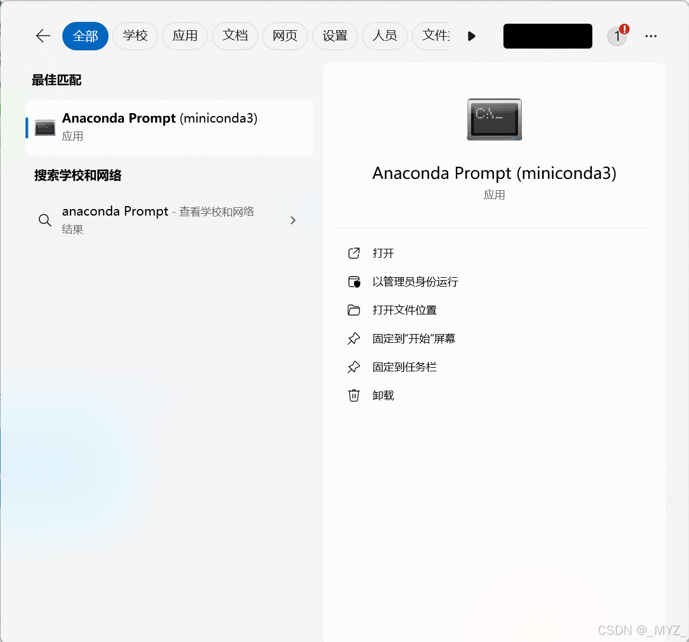

# HistoryTool
## 1.使用说明
使用本工具需按照以下步骤：

**目前macOS暂不可用**

1. 安装Python，配置虚拟环境；
2. 下载本工具到本地；
3. 安装相关依赖，即可运行。

推荐使用具有NVIDIA独显的Windows电脑，在本地处理PDF文件和图像识别时速度显著更快。

## 2.使用教程
### 1.安装Python
本工具运行必须具有Python虚拟环境，因此首先需要安装Python。推荐安装miniconda，该工具提供一个更轻量级的选项来安装和运行conda环境。

- miniconda安装地址：[Windows系统版本](https://mirrors.tuna.tsinghua.edu.cn/anaconda/miniconda/Miniconda3-py311_24.7.1-0-Windows-x86_64.exe)；[MacOS系统版本](https://mirrors.tuna.tsinghua.edu.cn/anaconda/miniconda/Miniconda3-py311_24.7.1-0-MacOSX-x86_64.pkg)。

下载完成后，安装miniconda，安装路径可任意修改，但请尽量避免中文，在安装过程中遇到以下界面时，**勾选图中选项**。


安装结束后，在菜单栏中直接打开或搜索Anaconda Prompt。



打开后如显示以下内容，则表示安装成功。


### 2.配置虚拟环境
以创建一个名为myenv（名称可自定义）的Python版本为3.11.8（推荐版本）的miniconda虚拟环境为示例介绍Miniconda的使用。**请注意：后续终端中输入语句时，一定注意开头为(myenv)而不是(base)，如果不是的话请使用激活语句更改环境**

在Anaconda Prompt中输入以下代码：

```python
conda create -n myenv python=3.11.8
```

输入创建代码后在Proceed（[y]/n）?处输入y，显示如图所示代码则表示myenv创建成功。（-n <虚拟环境名称>，n表示name。）


之后，激活该虚拟环境即可：

```python
conda activate myenv
```

### 3.安装Pytorch
查询显卡的cuda版本，在终端中输入：

```python
nvidia-smi
```
请先看下图左边的NVIDIA-SMI后面的数字，低于400请更新显卡驱动。


红框中为自己的CUDA版本信息，前往[Pytorch官网](https://pytorch.org/)，这里选择的Pytorch的CUDA版本要小于你实际安装的CUDA版本，即按照图中12.6版本的CUDA，选择小于12.6版本的语句复制，如：

```python
pip3 install torch torchvision torchaudio --index-url https://download.pytorch.org/whl/cu121
```

将上述语句复制到终端中运行即可安装Pytorch。

### 4.下载安装本工具
在本工具的Github页面点击code，之后点击Download ZIP，打包下载到本地。


下载完毕后，将其解压缩至任意目录（尽可能使用全英文目录）。并在解压后的文件根目录（Homepage.py文件所在目录）单击右键，选择在终端中打开，并输入以下代码激活虚拟环境后，安装依赖：

```python
conda activate myenv
```

```python
pip3 install -r requirements.txt
```

待安装完毕后，双击run.bat即可运行。